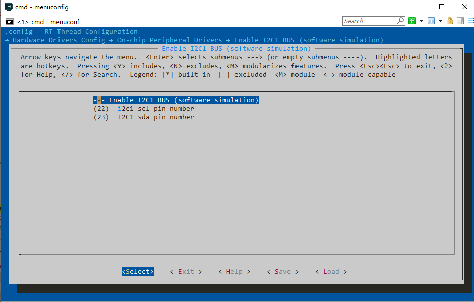
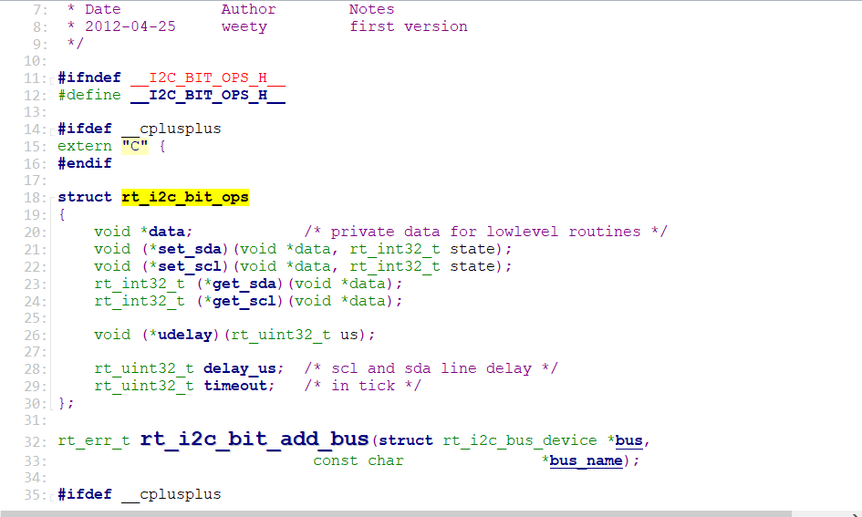
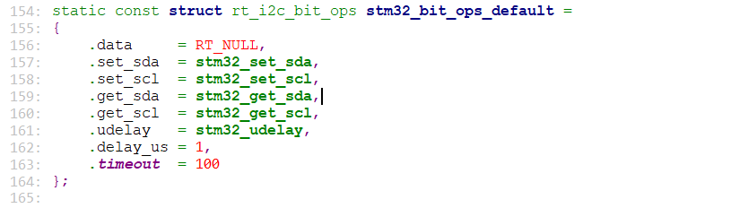
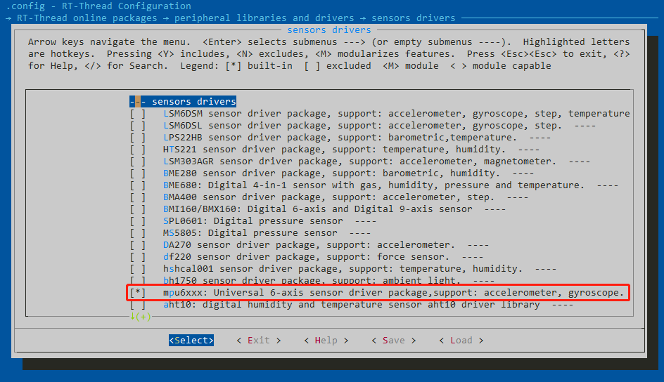
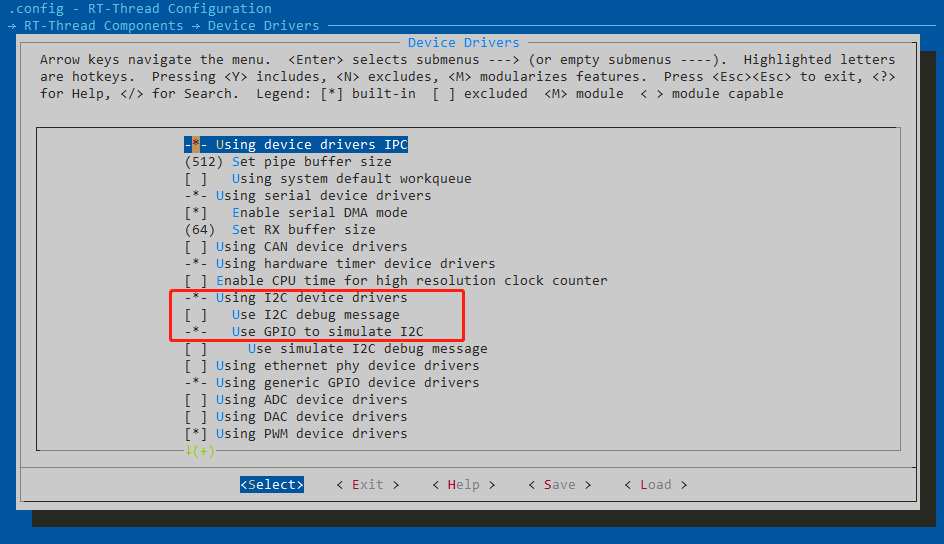
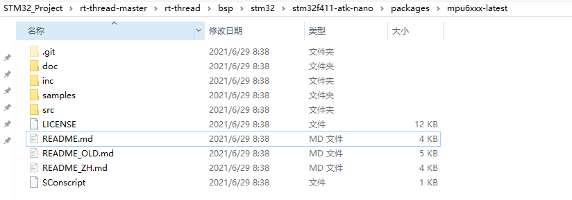
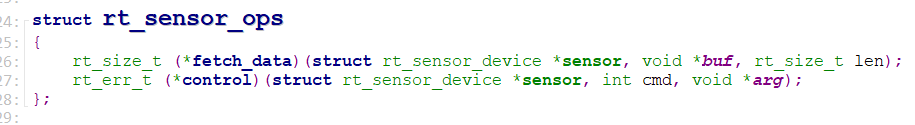
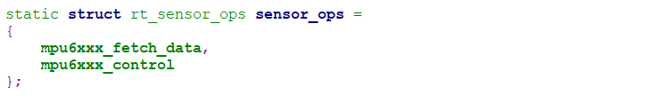

## 说明
本文档对RT-Thread的**I2C**设备驱动流程进行简要说明，并在此基础上分析**SENSOR**设备驱动流程，基于mpu6050传感器，使用I2C总线进行通信。

## I2C总线设备
首先使用*menuconfig*工具配置工程，使能I2C总线（软件模拟方式），配置成功重新编译工程后，在*rtconfig.h*配置文件中默认添加内容如下：
```
#define BSP_USING_I2C1
#define BSP_I2C1_SCL_PIN 22
#define BSP_I2C1_SDA_PIN 23
```


I2C总线驱动直接相关的文件及其作用：
| 文件                |          功能 | 
| ------------------- | ------------- | 
| i2c-bit-ops.c      | 通过位操作实现I2C时序通信 |
| i2c_core.c        | 连接I2C底层操作 和 I2c设备驱动的桥梁 |
| i2c_dev.c         | 为I2C设备驱动提供接口 |
| drv_soft_i2c.c    | 基于硬件实现上述函数预留接口内容 |

在i2c-bit-ops.h中定义的i2c设备操作接口，在drv_soft_i2c.c中都一一实现了：


基于硬件的回调函数：


#### 初始化流程
从drv_soft_i2c.c的rt_hw_i2c_init()开始，  -> rt_i2c_bit_add_bus() -> rt_i2c_bus_device_register() -> rt_i2c_bus_device_device_init()。**主要完成了**：I2C设备GPIO初始化、I2C总线设备注册、 I2C总线设备初始化（回调函数关联）；

#### 传输数据
获取到 I2C 总线设备句柄就可以使用 rt_i2c_transfer() 进行数据传输。函数原型如下所示：
```
rt_size_t rt_i2c_transfer(struct rt_i2c_bus_device *bus,
                          struct rt_i2c_msg         msgs[],
                          rt_uint32_t               num);
```
|参数 	|   描述   |
| ----      |  ----         |
|bus 	    |  I2C 总线设备句柄 |
| msgs[] 	|  待传输的消息数组指针  |
| num 	    | 消息数组的元素个数    |
| **返回** 	    | —— |
|消息数组的元素个数 | 	成功 |
| 错误码 |	失败  |


## MPU6050传感器
RT-Thread支持mpu6050传感器驱动程序，可以直接使用menuconfig工具进行配置，配置过程如下：
配置mpu6xxx软件包：


打开软件I2C：


> 第一次配置mpu6xxx软件包后，使用`pkgs --update`命令更新一下软件包.会在当前工程文件夹中生成一个packages文件夹，包含mpu6xxx驱动程序及使用方法。



对于mpu6xx驱动来说，可以直接使用mpu6xx.c文件中的接口函数。也可以使用**SENSOR**设备驱动进行统一管理。如果使用SENSOR设备驱动，则使用`sensor_inven_mpu6xxx.c`中的rt_hw_mpu6xxx_init()函数对设备进行初始化；如果直接使用mpu6xx.c文件中的接口函数，则使用mpu6xxx_init()进行初始化。
SENSOR设备驱动提供的两个回调函数接口：


mpu6xxx实现回调函数：

> mpu6xxx的回调函数中最终接口还是调用了mpu6xxx.c文件中的接口；

#### 和I2C总线关联
和i2c总线关联时，mpu6xxx_init()函数在调用时，第一个参数需要为I2C设备名称。